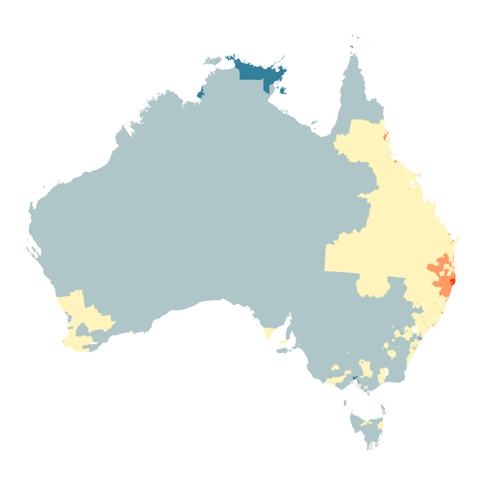
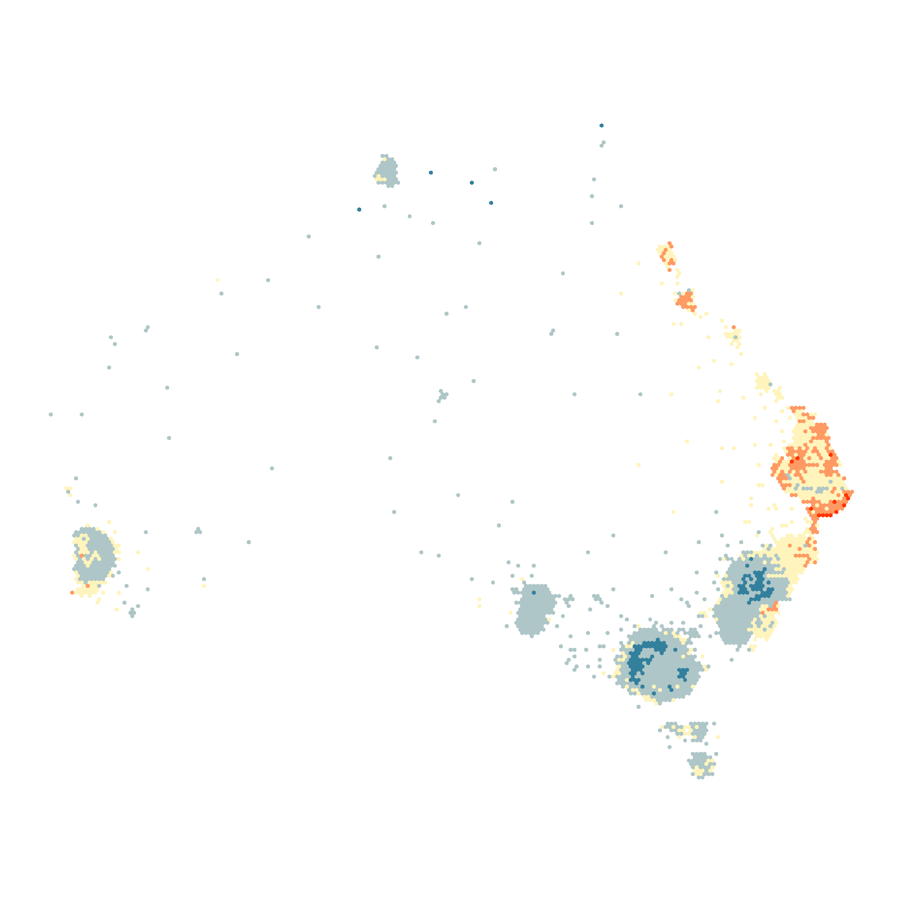

# An Algorithm For Spatial Mapping Using a Hexagon Tile Map, With Application to Australian Maps {#ch:algorithm}

This chapter relates to the first research aim as stated in Section \ref{sec:aims}.
The chapter introduces the steps of the algorithm.
The steps follow the procedures implemented in the `sugarbag` [@sugarbag] package functions, that allow users to run the algorithm in `R` [@R]. It uses the Statistical Areas of Australia at Level 2, taking a subset and considering only those located within the island of Tasmania.
It also provides an example of how to animate between the choropleth map display and the hexagon tile map.


This chapter will be submitted for publication to the *Journal of Statistical Software* for publication. 
The steps in this algorithm are implemented in the `sugarbag` [@sugarbag] package for `R` [@R].


## Abstract {-}

This algorithm creates a tessellated hexagon display to represent each of the spatial polygons. It allocates these hexagon in a manner that preserves the spatial relationship of the geographic units. It showcases spatial distributions, by emphasising the small geographical regions that are often difficult to locate on geographic maps. Spatial distributions have been presented on alternative representations of geography for many years. In modern times, interactivity and animation have begun to play a larger role, as alternative representations have been popularised by online news sites, and atlas websites with a focus on public consumption. Applications are increasingly widespread, especially in the areas of disease mapping, and election results.


```{r setup, echo=FALSE, message=FALSE, warning=FALSE, comment = FALSE}
library(knitcitations)
library(RefManageR)
library(sf)
library(sugarbag)
 
knitr::opts_chunk$set(warning = FALSE, message = FALSE)
options("citation_format" = "pandoc")
BibOptions(check.entries = FALSE, style = "markdown")
```

## Introduction

<!-- Motivation to map -->

The current practice for presenting geospatial data is a choropleth map display. These maps highlight the geographic patterns in geospatially related statistics [@SAMGIS].
The land on the map space is divided into geographic units, these boundaries are usually administrative, such as states or counties. The units are filled with colour to represent the value of the statistic [@EI].

<!-- urbanisation -->
Australian residents are increasingly congregating around major cities, the vast rural areas are often sparsely populated in comparison to the urban centres. 
In Australia, government bodies such as the Australian Bureau of Statistics (ABS), and the Australian Electoral Commission (AEC) hold the responsibility for the division of the population into geographic units. If it necessary, the AEC may adjust the boundaries of the areas as the population increases. The division of the population into approximately equal population areas results in dramatically different square meterage of the geographic areas. This can give unequal attention to the statistic of each area, this can cause misrepresentation of the spatial distributions of human related statistics in geographic maps. 

<!-- solutions -->
The solutions to this visualisation problem begin with the geography. Cartograms apply a transformation to the geographic boundaries based on the value of the statistic of interest. These displays result in a distortion of the map space to represent differences in the statistic across the areas [@ACCAC]. 
The statistic of interest is used to determine the cartogram layout. When the
Australian population is the statistic of interest, the result is a population cartogram. They fail to preserve a recognisable display due to the difference in size of metropolitan and rural areas [@ACTUC], [@GOINO].
Contiguous cartograms change the shape of areas, while preserving boundary relationships of neighbours. Non-contiguous cartograms maintain the geographic shape of each geographic area, but will lose the connection to neighbours as the polygon for each geographic area shrinks or grows.

Alternative maps shift the focus from land area and shape, to the value of the statistics in a group of areas.
Alternative mapping methods allow increased understanding of the spatial distribution of a variable across the population, by fairly representing each administrative area. This acknowledges that the amount of residents can be different but recognises that each area, or person within it is equally important.

tile maps, Rectangular cartograms [@ORC] and Dorling cartograms [@ACTUC], all use one simple shape to represent each area. They place various importance on the preservation of spatial relationships, but all decrease the emphasis on the size of the geographic areas. These alternative map displays focus on the relationship between neighbours, attempting to preserve connections, and disregard the unique shapes of the administrative boundaries.

The `sugarbag` package provides a new algorithm to create tessellated hexagon tile maps. 
It emphasises the capital cities as population hubs, and emphasises the distances rather than size of large, rural geographic units.

## Algorithm

The algorithm presented in `sugarbag` package operates on a set of simple feature geometry objects, also known as `sf` [@sf] polygons.

There are four steps performed to create a tessellated hexagon tile map.
These steps can be executed by the main function, `create_hexmap`, or can be implemented separately for more flexibility. There are parameters used in the process that can be provided by users, if they are not, they will be automatically derived.

 1. Create the set of centroids to allocate
 2. Create the grid of hexagons locations to use
 3. Allocate each centroid to an available hexagon
 4. Transform the data for plotting

#### Parameters

The `create_hexmap` function requires several parameters, if they are not provided, the information will be derived from the simple features (`sf`) set of shapes used. Users may choose to only use the `allocate` function when they wish to use a set of centroids, rather than [@sf] polygons.

The following parameters must be provided to `create_hexmap}:

 - *shp:* an sf object containing the polygon information
 - *sf_id:* name of a column that distinguishes unique areas
 - *focal_points:* a data frame of reference locations used to allocate hexagons
 
#### Polygon set

The polygon set of Statistical Areas at Level 2 (SA2) [@abs2016] of Tasmania in 2016 is provided with the `sugarbag` package as `tas_sa2`. 
A single column of the data set is used to identify the unique areas. 
In this case, the unique SA2 names for each SA2 have been used.

The longitude and latitude centre of the capital cities of Australia are used as focal points to allocate each geographic area around the closest capital city. Hobart will be the common focal point, as this example uses only the areas in the state of Tasmania.

```{r capital_cities}
data(capital_cities)
```


The following parameters will be determined within `create_hexmap` if they are not provided. They are created as they are needed throughout the following example:

 - *buffer_dist:* a float value for distance in degrees to extend beyond the geometry provided
 - *hex_size:* a float value in degrees for the diameter of the hexagons
 - *hex_filter:* amount of hexagons around centroid to consider for allocation
 - *width:* the angle used to filter the grid points around a centroid
 
#### Create the set of centroid points

A set of centroids may be used directly. The set of polygons should be provided as an `sf` object, this is a data frame containing a `geometry` column. The `read_shape` function can assist in creating this object for use in `R`.

The centroids can be derived from the set of polygons using the `create_centroids` function:

```{r cents}
centroids <- create_centroids(shp_sf = tas_sa2, sf_id = "SA2_NAME16")
```

<!-- ```{r centroids-plot, out.width = "100%", echo = FALSE, eval = FALSE, fig.cap = "The geographic shapes of the Statistical Areas of Tasmania at Level 2. The points show the locations of the centroids of the SA2 areas."} -->
<!-- knitr::include_graphics(path = "figures/03-algorithm/1centroids.png") -->
<!-- ``` -->


\begin{figure}[H]
\centering
\includegraphics[width=14cm]{figures/03-algorithm/1centroids.png}
\caption{\label{fig:centroids_plot}The geographic shapes of the Statistical Areas of Tasmania at Level 2. The points show the locations of the centroids of the SA2 areas.}
\end{figure}


#### Create the hexagon grid points

A grid is created to ensure tessellation between the hexagons that represent the geographic units on a hexagon tile map.

The grid of possible hexagon locations is made using the `create_grid` function.
It uses the centroids, the hexagon size and the buffer distance.

```{r grid}
grid <- create_grid(centroids = centroids, hex_size = 0.2, buffer_dist = 1.2)
```

###### Step 1: Creating a tessellated grid

A set of longitude columns, and latitude rows are created to define the locations of the hexagons. The distance between each row and column is the size specified by `hex_size`.
Equally spaced columns are created from the minimum longitude minus the buffer distance, up to the maximum longitude plus the buffer distance. Similarly, the rows are created from the latitude values and the buffer distance.
A unique hexagon location is created from all intersections of the longitude columns and latitude rows.
Figure \ref{fig:grid2} shows the original grid on the left, to allow for tessellating hexagons, every second latitude row on the grid is shifted right, by half of the hexagon size. The grid for tessellation is shown on the right.

<!-- ```{r grid2, fig.cap = "Grid points to create a tile map.", out.width = "100%", echo = FALSE} -->
<!-- knitr::include_graphics(path = "figures/03-algorithm/2grid.png") -->
<!-- ``` -->


\begin{figure}[H]
\centering
\includegraphics[width=14cm]{figures/03-algorithm/2grid.png}
\caption{\label{fig:grid2}Grid points to create a tile map.}
\end{figure}


###### Step 2: Rolling windows

Not all of the grid points will be used, especially if islands result in a large grid space.
To filter the grid for appropriate hexagon locations for allocation, the `create_buffer` function is used by `create_grid`.
It finds the grid points needed to best capture the set of centroids on a hexagon tile map.

The closest latitude row and longitude column are found for each centroid location. Then rows and columns of centroids are divided into 20 groups.
The amount of rows in each latitude group and the amount of columns in each longitude group are used as the width of rolling windows. The rolling windows can be seen on the bottom and right of the grid shown in Fig. \ref{fig:filter-grid}.
This will tailor the available grid points to those most likely to be used.
It also helps reduce the amount of time taken, as it decreases the amount of points considered for each centroid allocation.


The first rolling window function finds the minimum and maximum centroid values for the sliding window groups of longitude columns and the groups of latitude rows.

The second rolling window function finds the average of the rolling minimum and maximum centroid values, for the longitude columns and latitude rows.


###### Step 3: Filtering the grid

The grid points are kept only if they fall between the rolling average of the minimum and maximum centroid values after accounting for the buffer distance, for each row and column of the grid. The sparsely populated South-West region of National Park has much fewer points available compared to the South-East region containing the city of Hobart.

<!-- ```{r filter-grid, fig.cap = "All possible hexagon locations from the initial grid are shown with blue outlines. The blue dots show the grid points left to choose from after the buffer step. The rolling windows show the collections of rows and columns used to filter the hexagon locations.", echo = FALSE, out.width = "100%"} -->
<!-- knitr::include_graphics(path = "figures/03-algorithm/3grid.png", dpi = 300) -->
<!-- ``` -->

\begin{figure}[H]
\centering
\includegraphics[width=8cm]{figures/03-algorithm/3grid.png}
\caption{\label{fig:filter-grid}All possible hexagon locations from the initial grid are shown with blue outlines. The blue dots show the grid points left to choose from after the buffer step. The rolling windows show the collections of rows and columns used to filter the hexagon locations.}
\end{figure}

#### Centroid to focal point distance 

The distance between each centroid in the set, and each of the focal points provided is calculated. The name of the closest focal point, and the distance and angle from focal point to polygon centroid is joined to polygon data set. To minimise time taken for this step only one option is provided, Tasmania's capital city Hobart.
The order for allocation is determined by the distance between the polygon centroid and it's closest focal point. The points are arranged from the centroid closest to the focal point(s), to the furthest.

#### Allocate each centroid to a hexagon grid point

Allocation of all centroids takes place using the set of polygon centroids and the hexagon map grid. 
Centroid allocation begins with the closest centroid to a focal point.
This will preserve spatial relationships with the focal point, as the inner city areas are allocated first, they will be placed closest to the capital, and the areas that are further will then be accommodated.
The possible hexagon grid points reduces by one after each allocation, then only those that have not yet been allocated are considered.

The possible hexagon locations to consider for a centroid are determined by the `hex_filter`. This is the maximum amount of hexagons between the centroid and the furthest considered hexagon. It is used to subset possible grid points to only those surrounding the polygon centroid within an appropriate range. A smaller distance will increase speed, but can decrease accuracy when width of the angle increases.

```{r centroids, eval = FALSE}
hexmap_allocation <- allocate(
  centroids = centroids %>% select(SA2_NAME16, longitude, latitude),
  sf_id = "SA2_NAME16",
  hex_grid = grid,
  hex_size = 0.2, ## same size used in create_grid
  hex_filter = 10,
  width = 35,
  focal_points = capital_cities,
  verbose = TRUE)
```

The following example considers the first of the Statistical Areas at Level 2. 
Within the algorithm, these steps are repeated for each polygon.

###### Step 1: Filter the grid for unassigned hexagon points

Keeping only the available hexagon points prevents multiple geographic units from being allocated to the same hexagon.

###### Step 2: Filter the grid points for those closest to the centroid

A box of possible hexagon locations around the centroid allows only the closest points that are not yet assigned to be considered. The corners of the box may not appear square if the buffer step has already removed unnecessary points from over the ocean.

The algorithm then removes the outer corners of the square, creating a circle of points, by only keeping points within a certain radial distance around the original centroid location.


<!-- ```{r buffers, fig.cap = "Filter for grid points within a square, then circular, distance for those closest to the centroid.", echo = FALSE, out.width = "100%"} -->
<!-- knitr::include_graphics(path = "figures/03-algorithm/4grid.png") -->
<!-- ``` -->

\begin{figure}[H]
\centering
\includegraphics[width=14cm]{figures/03-algorithm/4grid.png}
\caption{\label{fig:buffers}Filter for grid points within a square, then circular, distance for those closest to the centroid.}
\end{figure}

The `width` parameter is used to take a slice of the remaining points. The width is the amount of degrees used on either side of the angle from the focal point to centroid location. This uses the angle from the closest capital city, to the current centroid as seen in Figure \ref{fig:angles} . This allows the spatial relationship to be preserved, even when it is allocated to a hexagon that is further from the focal point then the original centroid location.


<!-- ```{r angles, fig.cap = "Filter for grid points within the angle from the focal point to the centroid.", echo = FALSE, out.width = "100%"} -->
<!-- knitr::include_graphics(path = "figures/03-algorithm/5allocate.png") -->
<!-- ``` -->


\begin{figure}[H]
\centering
\includegraphics[width=14cm]{figures/03-algorithm/5allocate.png}
\caption{\label{fig:angles}Filter for grid points within the angle from the focal point to the centroid.}
\end{figure}


If no available hexagon grid point is found within the original filter distance and angle, the distance is expanded, only when a maximum distance is reached will the angle expand to accommodate more possible grid points.  
By default the angle filter to hexagon grid points that fall within the bounds of the angle from the focal point to the geographic centroid, plus and minus 30 degrees. This will increase if no points can be found within the `hex_filter` distance. The default angle of 30 was chosen to allow the algorithm to choose hexagons that best maintained the spatial relationship between the focal point and geographic centroid.


<!-- ```{r buffs, fig.cap = "A complete hexagon tile map of Tasmania.", out.width = "100%", echo = FALSE} -->
<!-- knitr::include_graphics(path = "figures/03-algorithm/6allocate.png") -->
<!-- ``` -->


\begin{figure}[H]
\centering
\includegraphics[width=14cm]{figures/03-algorithm/6allocate.png}
\caption{\label{fig:buffs}A complete hexagon tile map of Tasmania.}
\end{figure}

A complete hexagon tile map of Tasmania is created by applying the algorithm steps to each centroid.
The hexagon tile map visualisation is used below to visualise the Australian Cancer Atlas data. Two views of the same data are produced by filling according to the Lung Cancer Standardised Incidence Rates (SIRs) downloaded from the Australian Cancer Atlas site. This small example in Figure \ref{fig:sir} shows the group of blue areas in the Hobart CBD more prominently in the hexagon tile map (b).
The small red areas visible in the choropleth map (a) along the north coast are much larger in the hexagon tile maps. The hexagon tile map shows less yellow, this no longer overwhelms the map space with the information regarding the rural areas. 


<!-- ```{r sir, out.width = "100%", echo = FALSE, fig.cap = "The Australian Cancer Atlas data has determined the colour of each Statistical Area of Australian at Level 2. A choropleth map (a) of Standardised Incidence Rates (SIRs) is paired with a hexagon tile map (b) to contrast the colours that are made obvious when every SA2 is equally represented."} -->
<!-- knitr::include_graphics(path = "figures/03-algorithm/7SIR.png") -->
<!-- ``` -->


\begin{figure}[H]
\centering
\includegraphics[width=14cm]{figures/03-algorithm/7SIR.png}
\caption{\label{fig:sir}The Australian Cancer Atlas data has determined the colour of each Statistical Area of Australian at Level 2. A choropleth map (a) of SIR is paired with a hexagon tile map (b) to contrast the colours that are made obvious when every SA2 is equally represented.}
\end{figure}

#### Neighbour relationships

It is possible to consider the neighbouring areas for each SA2, for stronger preservation of the spatial distribution.

An additional step can be included to allow the neighbours that have already been allocated to influence the placement of the current centroid. 
This requires specifying the `sf` object as the argument for the `use_neighbours` parameter. This calculates neighbours using intersections of their polygons. This occurs for all areas before any allocations begin.

During the allocation of each centroid, the list of neighbours is consulted. If any neighbour was already allocated, the hexagons surrounding the neighbours on the grid are prioritised. For multiple neighbours, the neighbouring hexagon grid points are aggregated and considered in order of distance from the original centroid.

## Using sugarbag

#### Installation

The package can be installed from CRAN:

```{r eval=FALSE}
install.packages("sugarbag")
```

and the development version can be install from the GitHub repository:

```{r eval=FALSE}
devtools::install_github("srkobakian","sugarbag")
```

Load the library into your R session with:

```{r}
library(sugarbag)
```

#### Creating a hexagon tile map

The following code creates the hexagon tile map for all the Statistical Areas at Level 2 in Tasmania.

```{r full_hexmapcode, echo = TRUE, warning = FALSE, message = FALSE, eval=FALSE}
## Load data
data(tas_sa2)

## Create centroids set
centroids <- create_centroids(tas_sa2, "SA2_NAME16")

## Create hexagon grid
grid <- create_grid(centroids = centroids,
    hex_size = 0.2,
    buffer_dist = 1.2)

## Allocate polygon centroids to hexagon grid points
hex_allocated <- allocate(
  centroids = centroids,
  hex_grid = grid,
  sf_id = "SA2_NAME16",
  ## same column used in create_centroids
  hex_size = 0.2,
  ## same size used in create_grid
  hex_filter = 10,
  use_neighbours = tas_sa2,
  focal_points = capital_cities %>% filter(points == "Hobart"),
  width = 35,
  verbose = FALSE)

## Prepare to plot
fort_hex <- fortify_hexagon(data = hex_allocated,
  sf_id = "SA2_NAME16", hex_size = 0.2)

## Make a plot
library(ggplot2)
ggplot(fort_hex) + 
  geom_polygon(aes(x=long, y=lat, group=hex_id, fill = lat)) +
  scale_fill_distiller("", palette="PRGn")
```


## Applications

#### Australian Cancer Atlas

The Australian Cancer Atlas [@TACA] allows estimates derived from the models of SIRs and excess deaths to be downloaded. 
Figure \ref{fig:melanoma-geo} is a choropleth map that uses colour to display the estimated SIRs of melanoma cancer for all persons for each SA2. The Australian choropleth map display draws attention to the expanse of light blue areas across the rural communities in all states. The SA2s around Brisbane stand out as more orange and red.
Comparatively, the hexagon tile map display in Figure \ref{fig:melanoma-hex} draws attention to contrast of the blue areas in Sydney and Melbourne and the capital city of Brisbane. In both Sydney and Melbourne, the hexagons that represent the SA2 areas in the inner-city areas have lower than average Incidence Rates.

With careful consideration of the choropleth map, the small geographic inner city areas may have been noticed by viewers, but the hexagon tile map display emphasises them. The communities in northern Queensland and the Northern territory do not draw attention because of their size as in the choropleth, but their colour is still noticeably below average when contrasted with the hexagons further south.
 
To create this choropleth map the SA2 polygons for 2011 from the ABS. The SIRs for each geographic unit are joined to the appropriate polygons.


<!-- ```{r melanoma-geo, fig.cap = "A choropleth map of the Statistical Areas of Australia at Level 2. The colours communicate the value of the estimated Standardised Incidence Rate of Melanoma for all persons, they range from much lower than average (blue) to much higher than average (red)", results = "asis", echo = FALSE, out.width = "60%"} -->
<!--  -->
<!-- ``` -->


\begin{figure}[H]
\centering
\includegraphics[width=14cm]{figures/03-algorithm/aus_melanoma_p.pdf}
\caption{\label{fig:melanoma-geo}A choropleth map of the Statistical Areas of Australia at Level 2. The colours communicate the value of the estimated SIR of Melanoma for all persons, they range from much lower than average (blue) to much higher than average (red)}
\end{figure}


To create the hexagon tile map display, the same steps are followed as outlined above:

 - Create the set of centroid points
 - Create the hexagon grid points
 - Allocate each centroid to a hexagon grid point

<!-- ```{r melanoma-hex, fig.cap = "A hexagon tile map of the Statistical Areas of Australia at Level 2. The colours communicate the value of the estimated Standardised Incidence Rate, they range from much lower than average (blue) to much higher than average (red)", results = "asis", echo = FALSE, out.width = "60%"} -->
<!--  -->
<!-- ``` -->

\begin{figure}[H]
\centering
\includegraphics[width=14cm]{figures/03-algorithm/aus_melanoma_p_hex.pdf}
\caption{\label{fig:melanoma-hex}A hexagon tile map of the Statistical Areas of Australia at Level 2. The colours communicate the value of the estimated SIR, they range from much lower than average (blue) to much higher than average (red)}
\end{figure}

## Animation 

The `gganimate` [@gganimate] package can be used to make an animation.
It requires connecting the polygons for each area in two displays, which can be done using the `sf_id` variable, such as the SA2 name.
The animation^[This animation can be viewed at: https://sugarbagjss.netlify.com/] connecting these two displays will highlight the rapid growth of the inner-city areas, and will decrease the large rural areas. The hexagons that move the furthest will move rapidly in the animation.


## Conclusion

It is possible to use alternative maps to communicate spatial distributions.While a choropleth map display is the current practice spatial visualisation of geographical data. Current methods do not always work for Australia due to the large geographic space between the densely populated capital cities. The administrative boundaries may also distract from the statistics communicated using colour.

Alternative maps highlight the value of the statistics across the geographic units. Alternative mapping methods allow increased understanding of the spatial distribution of a variable across the population, by fairly representing each administrative area. This acknowledges that the amount of residents can be different but recognises that each population area is equally important. The solution to this visualisation problem has equally sized areas, with neighbourhood boundary connections. This map algorithm is implemented in the `sugarbag` [@sugarbag] package written for `R` [@R].
The `sugarbag` package creates tessellated hexagon tile maps. The Australian application preserves the spatial relationships, emphasising capital cities. The hexagon tile map is a visualisation solution that highlights spatial distributions.

These hexagons equally represent each area. However, the tessellation does not allow the size of the hexagons to represent another variable, similar to the choropleth maps.
The algorithm is heavily dependent on the focal points used, as this determines the order of allocation. It works on the assumption that viewers can use directional relationships to identify their neighbourhoods but this can be aided by the animation.

<!-- future -->
Future work will include refining the algorithm. It would be possible to take a logarithmic function rather than a direct angle to help choose a closer hexagon to the original centroid location, before increasing the width of the angle used to filter the hexagons.

This algorithm has only been tested using single countries, and does not consider definite borders of countries. While the buffer allows extension beyond the furthest centroids, there is no mechanism to protect the borders and ensure centroids are placed within the geographic borders of a country.

This algorithm is an effective start to creating hexagon tile maps for many geographic units.
